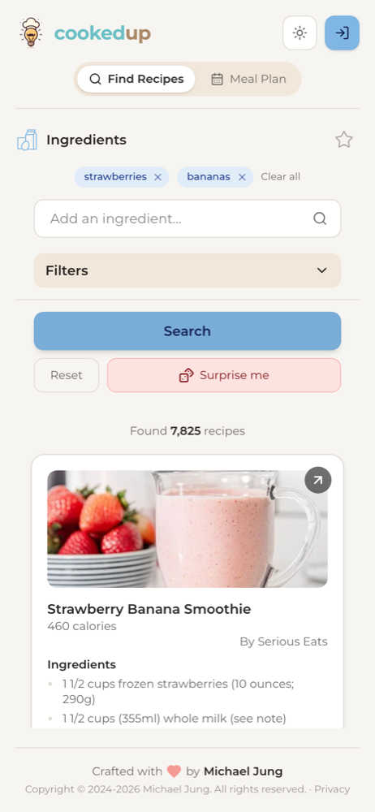

<div align="center" id="readme-header">


# cookedup

**Find recipes with what's already in your kitchen, then plan your week around them.**

[**Live site**](https://www.cookedup.app) &nbsp;•&nbsp; [GitHub](https://github.com/michaelhjung/cookedup)

[](https://www.typescriptlang.org/)
[](https://nextjs.org/)
[](https://tailwindcss.com/)
[](https://supabase.com/)
[](https://vercel.com/)

</div>

<picture>
  <source media="(prefers-color-scheme: dark)" srcset="./.github/readme/results-dark.jpg">
  
</picture>

## What it does

You tell it what's in the fridge; it tells you what to cook. No account needed to search.

- **Search by ingredient** — pick from a curated list or type your own, and get recipes that actually use them, with ingredient lists, calories and cook time on the card.
- **Or browse by filter** — cuisine, diet, health restrictions, meal and dish type, with infinite scroll and a "Surprise me" button that picks one for you.
- **Save the keepers** — starred recipes live in your library.
- **Plan the week** — drag saved recipes onto a calendar with fully customizable meal slots (rename, retime, add a second snack, drop breakfast).
- **Subscribe from any calendar app** — each plan exposes an ICS feed that Google Calendar, Apple Calendar or Outlook can follow.
- **Share it** — read-only share links for whoever eats with you, and editor invites for whoever cooks with you.
- **Sign in with Google or a magic link**, in light or dark mode, on desktop or phone.

<p align="center">
  
  &nbsp;
  
</p>

## How it's built

Next.js (App Router) on Vercel, Supabase for auth, Postgres and storage, the Edamam Recipe Search API for recipe data. Styling is Tailwind on top of a small set of design tokens (a two-step pastel palette, a three-value radius scale) so light and dark themes are a variable swap rather than parallel class lists.

A few of the decisions worth knowing about:

- **Recipe thumbnails are persisted on save.** Edamam serves images as pre-signed S3 URLs that expire, so a saved recipe's picture would break within days. Saving copies the image into a Supabase Storage bucket in a background `after()` task, so the star feels instant while the upload happens off the request.
- **Google sign-in uses a self-drawn button and the authorization-code flow.** Supabase's built-in OAuth redirect puts `<project>.supabase.co` on Google's consent screen, and Google's script-rendered button forces a white tile behind the logo in dark mode. Instead: Google Identity Services popup → one-time code → server-side exchange with the client secret → `signInWithIdToken`, all without leaving the page. Magic links go through a PKCE callback route.
- **Meal-plan drag and drop is hand-rolled on Pointer Events** — a 5px threshold for mouse, a 300ms long-press for touch so swipe-to-scroll keeps working, and a portaled ghost that follows the pointer.
- **The calendar feed is built by hand** (`src/lib/ics/`) — RFC 5545 line folding, escaping and floating (timezone-free) times, so a 6pm dinner is 6pm wherever the subscriber is. The event builder is a seam for pushing to Google Calendar directly later.
- **Meal slots are data, not an enum.** Each plan stores an ordered `[{ id, label, time }]` array, entries reference a slot id, and rows always render sorted by time — so a plan can have two snacks and no breakfast without a migration.
- **Filter-mode "load more" is a dedupe loop.** Edamam's random mode has no cursor, so scrolling redraws with the same filters and merges in whatever's new, backing off after a few draws yield nothing unseen.
- **A daily Vercel cron pings Supabase** so the free-tier project doesn't get paused for inactivity.

Pure logic (the ICS builder, date helpers, event assembly, the auth callback and Google code exchange) is unit-tested with Vitest; UI is verified in a real browser.

## Running it locally

```bash
npm install
cp .env.example .env.local   # fill in the values below
npm run dev
```

| Variable                                                    | Purpose                                                   |
| ----------------------------------------------------------- | --------------------------------------------------------- |
| `EDAMAM_APP_ID`, `EDAMAM_API_KEY`                           | Edamam Recipe Search API v2 credentials                   |
| `NEXT_PUBLIC_SUPABASE_URL`, `NEXT_PUBLIC_SUPABASE_ANON_KEY` | Supabase project                                          |
| `NEXT_PUBLIC_GOOGLE_CLIENT_ID`, `GOOGLE_CLIENT_SECRET`      | Google sign-in (optional — the button hides without them) |
| `CRON_SECRET`                                               | Protects the keep-alive endpoint (optional locally)       |
| `NEXT_PUBLIC_UMAMI_ID`                                      | Umami analytics (optional)                                |

Database schema and storage policies live in [`supabase/setup.sql`](./supabase/setup.sql); run it once in the Supabase SQL editor.

```bash
npm test        # vitest
npm run lint
npm run build
```

---

<div align="center">

This project is **not open source**. The source code may not be copied, modified, or distributed without permission.

Copyright © 2024-2026 Michael Jung. All rights reserved.

</div>
