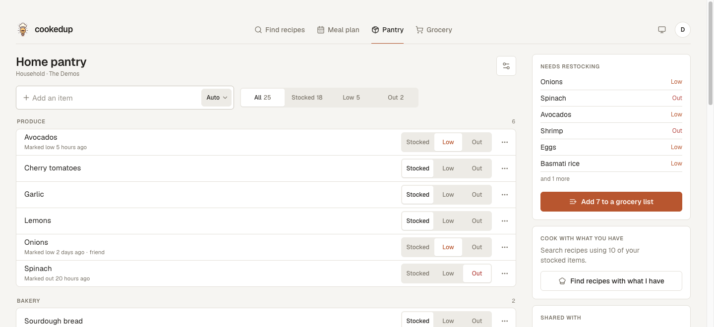
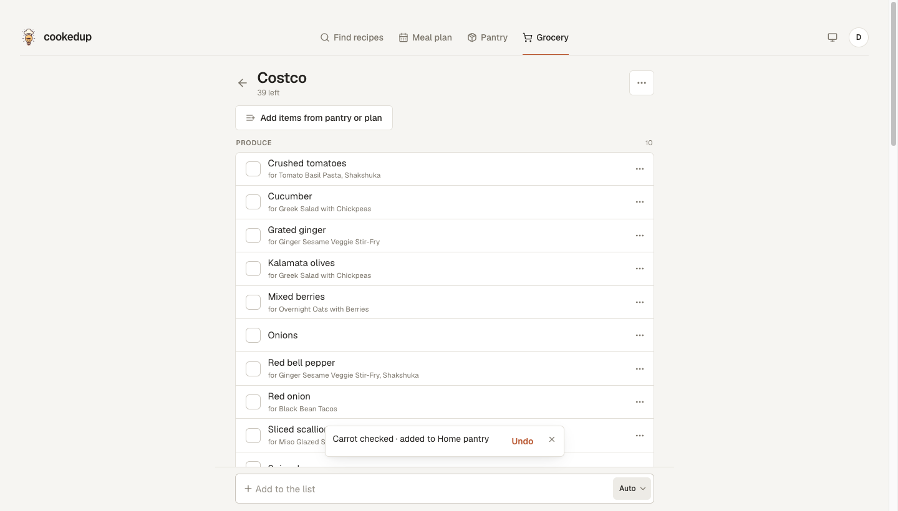
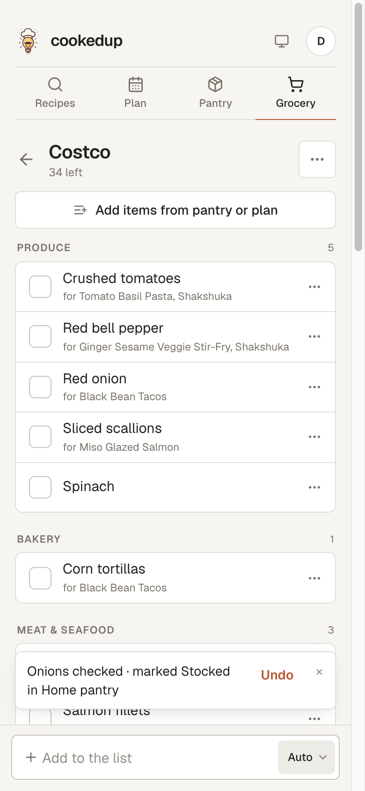
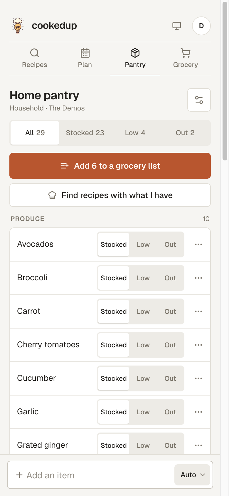
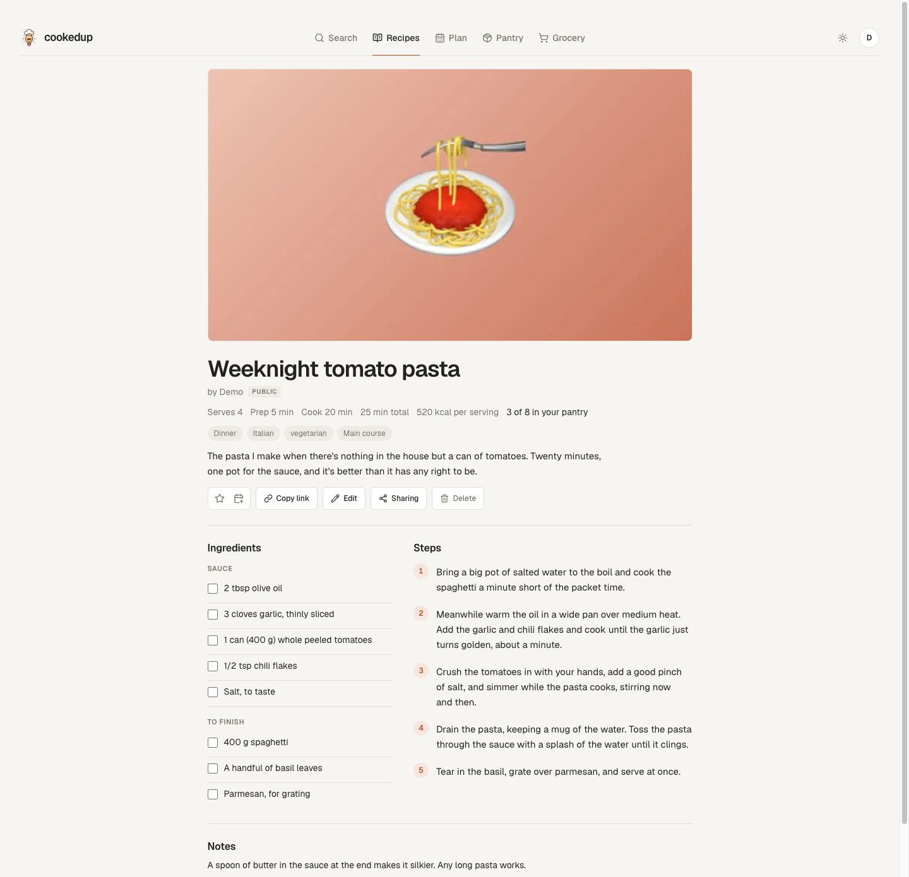
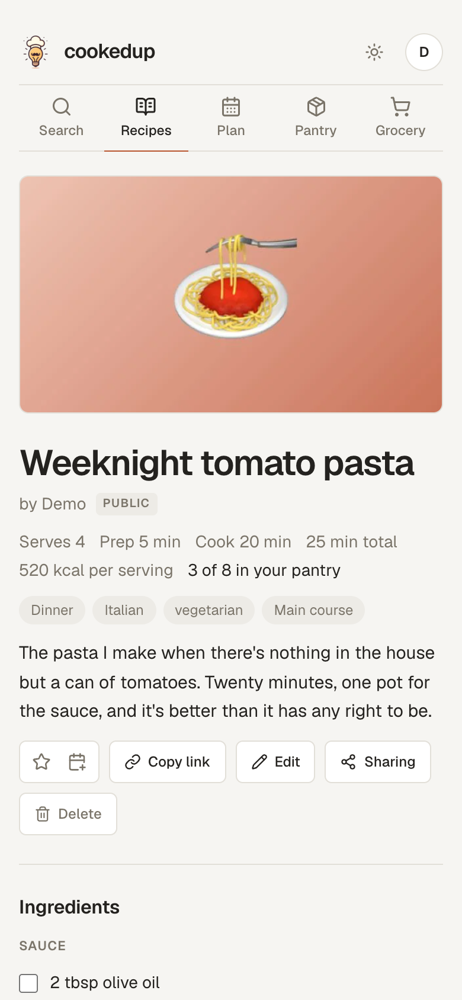

<div align="center" id="readme-header">


# cookedup

**Find recipes with what's already in your kitchen, plan your week around them, and keep the pantry stocked.**

[**Live site**](https://www.cookedup.app) &nbsp;•&nbsp; [GitHub](https://github.com/michaelhjung/cookedup)

[](https://www.typescriptlang.org/)
[](https://nextjs.org/)
[](https://tailwindcss.com/)
[](https://supabase.com/)
[](https://vercel.com/)

</div>

<picture>
  <source media="(prefers-color-scheme: dark)" srcset="./.github/readme/results-dark.jpg">
  
</picture>

## What it does

You tell it what's in the fridge; it tells you what to cook. No account needed to search. Sign in (Google or a magic link) and the rest opens up: a library, a planner, a pantry, grocery lists and your own recipes, all shareable with the people you live with.

### Find something to cook

- **Search by ingredient.** Pick from a curated list, grouped by aisle, or type your own, and get recipes that actually use them, with time, calories and ingredient count on the card.
- **Or browse by filter.** Cuisine, diet, health restrictions, meal and dish type, with infinite scroll and a "Surprise me" button that picks one for you.
- **See what you already have.** Each card says how many of its ingredients are stocked in your pantry.
- **Star the keepers.** They live in your library and feed the planner.

<p align="center">
  <picture>
    <source media="(prefers-color-scheme: dark)" srcset="./.github/readme/empty-dark.png">
    
  </picture>
  &nbsp;
  <picture>
    <source media="(prefers-color-scheme: dark)" srcset="./.github/readme/phone-dark.jpg">
    
  </picture>
</p>

### Plan the week

- **Drag recipes onto a calendar** with meal slots you define per plan: rename them, retime them, add a second snack, drop breakfast. A single meal can override its slot's time.
- **Repeat meals** the way Google Calendar does: weekly on chosen days or monthly, edited or removed as "this meal", "this and following" or "all".
- **Type in what isn't a recipe.** Leftovers, eating out, meal prep.
- **Copy last week**, jump to a date, switch between week and month.
- **Subscribe from any calendar app.** Each plan exposes an ICS feed that Google Calendar, Apple Calendar or Outlook can follow.

<picture>
  <source media="(prefers-color-scheme: dark)" srcset="./.github/readme/plan-week-dark.png">
  
</picture>

<p align="center">
  <picture>
    <source media="(prefers-color-scheme: dark)" srcset="./.github/readme/plan-month-dark.png">
    
  </picture>
  &nbsp;
  <picture>
    <source media="(prefers-color-scheme: dark)" srcset="./.github/readme/phone-plan-dark.png">
    
  </picture>
</p>

### Keep a pantry and shop from it

- **The pantry** is a list of what's in the kitchen, each item Stocked, Low or Out. Tap or long-press to change it; the store-walk grouping (produce, bakery, dairy...) is guessed from the name, and "Add the basics" fills an empty pantry with staples.
- **Grocery lists**, one per store, filled from what's running low, from what the next week of planned meals needs, or by hand. Checking something off in the aisle marks it Stocked back in the pantry, with an Undo.
- **Cook from it.** "Find recipes with what I have" runs a search on your stocked items.

<picture>
  <source media="(prefers-color-scheme: dark)" srcset="./.github/readme/pantry-dark.png">
  
</picture>

<p align="center">
  <picture>
    <source media="(prefers-color-scheme: dark)" srcset="./.github/readme/grocery-dark.png">
    
  </picture>
  &nbsp;
  <picture>
    <source media="(prefers-color-scheme: dark)" srcset="./.github/readme/phone-grocery-dark.png">
    
  </picture>
  &nbsp;
  <picture>
    <source media="(prefers-color-scheme: dark)" srcset="./.github/readme/phone-pantry-dark.png">
    
  </picture>
</p>

### Write your own recipes

- **A proper editor**: photo, servings, prep and cook time, ingredients (paste a whole list and it splits into lines; each line links itself to a pantry food so the pantry match works), numbered steps, tags from the same vocabulary as the filters, optional nutrition, source and notes.
- **A page of its own** at `/recipes/<id>`, with tick-off ingredients, "N of M in your pantry", and share previews when the link is posted somewhere.
- **Private, household, shared or public.** A recipe starts private. Share it with your household, invite someone by link, or publish it to the Community tab for everyone.
- **First-class everywhere else.** Star it, plan it, put it in the calendar feed: an authored recipe behaves exactly like a found one.

<p align="center">
  <picture>
    <source media="(prefers-color-scheme: dark)" srcset="./.github/readme/recipe-dark.png">
    
  </picture>
  &nbsp;
  <picture>
    <source media="(prefers-color-scheme: dark)" srcset="./.github/readme/phone-recipe-dark.png">
    
  </picture>
</p>

### Share it

- **A household** puts plans, pantries, lists and recipes in front of everyone who lives with you. Anything personal can still be shared one person at a time, as a viewer or an editor.
- **Lists update live** as someone else checks things off, and show who else is on them.

## How it's built

Next.js (App Router) on Vercel; Supabase for auth, Postgres, storage and realtime; the Edamam Recipe Search API for recipe data. Styling is Tailwind on a small set of design tokens (warm stone neutrals, one terracotta accent, a three-value radius scale) so light and dark are a variable swap rather than parallel class lists.

Decisions worth knowing about, by area:

**Data and access**

- **Access control lives in Postgres.** Every table is RLS-first, with `security definer` helpers (`can_read_plan`, `can_edit_list`, ...) that resolve owner → household member → explicit share. The browser never sees a row it can't read, and anything that touches two tables (checking off a grocery line restocks the pantry) is one RPC in one transaction.
- **Sharing is one polymorphic table.** `shares` and `invites` are keyed by `(resource_kind, resource_id)`, so a meal plan, a pantry, a grocery list and a recipe share one invite flow, one accept RPC and one settings panel. Households sit on top: a resource can be flipped to "everyone in the household" without inviting anyone.
- **User recipes are stored twice, on purpose.** `user_recipes` holds real columns (ingredients, steps, GIN-indexed tag arrays for a search integration later), and a trigger builds an Edamam-shaped `hit` JSON beside them with a relative `url` of `/recipes/<id>`. Cards, the planner, the library and the calendar feed consume that unchanged, so an authored recipe needs no special casing anywhere downstream. Editing the recipe refreshes every library snapshot of it.
- **Meal slots are data, not an enum.** Each plan stores an ordered `[{ id, label, time }]` array, entries reference a slot id, and rows always render sorted by time; two snacks and no breakfast needs no migration. Repeats are materialized rows tied to a `meal_plan_series`, split the way Google Calendar splits a series when you edit "this and following".
- **Recipe thumbnails are persisted on save.** Edamam serves images as pre-signed S3 URLs that expire, so a starred recipe's picture would break within days. Saving copies it into Supabase Storage in a background `after()` task, so the star feels instant. Authored photos are downscaled in the browser (≤1600px JPEG) before upload.
- **Pantry items and recipe ingredients meet on a normalized key** (lowercased, trimmed, singularized), so "Eggs" in the pantry skips "egg" on a generated list and matches Edamam's `food` field. A curated ingredient list with aisles and aliases drives the search dropdown, the store-walk grouping and the pantry match on cards.

**Auth**

- **Google sign-in uses a self-drawn button and the authorization-code flow.** Supabase's built-in OAuth redirect puts `<project>.supabase.co` on Google's consent screen, and Google's script-rendered button forces a white tile behind the logo in dark mode. Instead: Google Identity Services popup → one-time code → server-side exchange with the client secret → `signInWithIdToken`, without leaving the page. Magic links go through a PKCE callback route.

**UI**

- **Meal-plan drag and drop is hand-rolled on Pointer Events**: a 5px threshold for mouse, a 300ms long-press for touch so swipe-to-scroll keeps working, and a portaled ghost that follows the pointer.
- **The calendar feed is built by hand** (`src/lib/ics/`): RFC 5545 line folding, escaping and floating (timezone-free) times, so a 6pm dinner is 6pm wherever the subscriber is.
- **Filter-mode "load more" is a dedupe loop.** Edamam's random mode has no cursor, so scrolling redraws with the same filters and merges in whatever's new, backing off after a few draws yield nothing unseen.
- **Grocery lists are live.** Supabase Realtime streams line changes to every open copy of a list, and channel presence shows who else is on it.
- **A daily Vercel cron pings Supabase** so the free-tier project doesn't get paused for inactivity.

Pure logic (the ICS builder, date and recurrence helpers, event assembly, the auth callback, recipe-draft validation, ingredient matching) is unit-tested with Vitest; UI is verified in a real browser.

## Running it locally

You need Node 22.18+ (the seeder is TypeScript that Node runs directly), Docker (OrbStack is fine), and the Supabase CLI, which comes in as a dev dependency.

```bash
npm install
npm run db:start          # supabase start; the first run pulls containers, be patient
cp .env.example .env.local
```

`npx supabase status` prints the API URL and the anon/service keys. Put them in `.env.local` (the stack sits on ports 55321–55324 rather than the CLI's 54321 defaults so it can run next to another project's), then:

```bash
npm run db:reset          # build the schema from migrations, then seed the demo account
npm run dev               # http://localhost:3001
```

### Environment variables

| Variable                                               | Purpose                                                   |
| ------------------------------------------------------ | --------------------------------------------------------- |
| `EDAMAM_APP_ID`, `EDAMAM_API_KEY`                      | Edamam Recipe Search API v2 credentials                   |
| `SUPABASE_*`, `NEXT_PUBLIC_SUPABASE_*`                 | The local stack (above); production values live on Vercel |
| `ALLOW_TEST_LOGIN`                                     | Local only: the "Sign in as demo" button                  |
| `NEXT_PUBLIC_GOOGLE_CLIENT_ID`, `GOOGLE_CLIENT_SECRET` | Google sign-in (optional; the button hides without them)  |
| `SUPABASE_DB_PASSWORD`                                 | Production only, read by `npm run db:push`                |
| `CRON_SECRET`                                          | Protects the keep-alive endpoint (optional locally)       |
| `NEXT_PUBLIC_UMAMI_ID`                                 | Umami analytics (optional)                                |

`.env.example` says what each one is for and where it comes from.

### Signing in

- **As the demo account.** With `ALLOW_TEST_LOGIN=true` in `.env.local`, the sign-in modal grows a **Sign in as demo** button. The guard is server-side (`NODE_ENV` must not be production _and_ the flag must be set), so on a production build neither the button nor the `/api/test/login` route behind it exists.
- **Magic link.** Type any address. Locally nothing leaves your machine: the mail lands in **Mailpit at http://127.0.0.1:55324**, and the link in it signs you in. If a link bounces you back signed out, the redirect isn't allow-listed: `additional_redirect_urls` in `supabase/config.toml` has to cover `/auth/callback` on whatever port you're running.
- **Google.** Works locally once `NEXT_PUBLIC_GOOGLE_CLIENT_ID` and `GOOGLE_CLIENT_SECRET` are in `.env.local` and `http://localhost:3001` is an authorised JavaScript origin on the OAuth client. `npm run db:start` loads `.env.local` before `supabase start`, which is how the client id reaches the local auth server.

### The demo account

`npm run seed:demo` builds an account you can sign straight into, so testing a change never starts with starring a page of recipes. `npm run db:reset` runs it for you once the schema is rebuilt. Both users' password is `cookedup-demo`.

`demo@cookedup.local` has:

- eight recipes in the library (six starred, two only ever planned) and three written in the app: a public pasta with a photo, a private soup, and a friend's salad, starred;
- a household, "The Demos", with `friend@cookedup.local` joined through a real invite;
- a household plan for the current week with dinners most nights, overnight oats repeating every weekday for four weeks, and a couple of custom meals; plus a personal "Meal prep" plan shared with the friend;
- a household pantry of 25 items, a few marked Low or Out (some by the friend);
- two grocery lists: "Costco", built from the pantry's restock items with a couple of lines already checked off by the friend, and a personal "Farmers market".

So sharing, the calendar feed, the repeat-rule dialogs, restocking, live check-off and recipe visibility all have something to act on.

Found recipes are written in Edamam's `Hit` shape (`scripts/demo-data.ts`) with their images uploaded to the local `recipe-images` bucket, the same way a starred search result is stored. The images are placeholders in `supabase/seed/images/`; drop real photos in under the same names to make the demo look the part. The script refuses to run against any host but localhost.

## Database

The schema lives in `supabase/migrations/` and nowhere else: `npm run db:reset` rebuilds a local database from those files, and `npm run db:push` applies the ones production hasn't seen (it reads `SUPABASE_DB_PASSWORD` from `.env.local` and needs `npx supabase link` to have been run once). The files that were already on production when the migrations were introduced are frozen; every change since is a new dated file:

```bash
npx supabase migration new add_recipe_notes   # creates supabase/migrations/<timestamp>_add_recipe_notes.sql
npm run db:migrate                            # applies it locally (db:reset rebuilds from scratch instead)
npm run db:push                               # then to production
```

Or edit the schema in the local Studio (http://127.0.0.1:55323) and let `npx supabase db diff -f add_recipe_notes` write the migration for you; read it before pushing. A function whose signature changes is dropped by its old signature and created again, since `create or replace` would leave both.

Storage is set up by a migration too (the `recipe-images` bucket and its policies), so a fresh database is ready for images without any dashboard clicks.

## Scripts

| Command              | What it does                                                 |
| -------------------- | ------------------------------------------------------------ |
| `npm run dev`        | Dev server on http://localhost:3001                          |
| `npm run verify`     | Typecheck, lint, Prettier check and the Vitest suite         |
| `npm run build`      | Production build                                             |
| `npm run db:start`   | Start the local Supabase stack (`db:stop` to stop it)        |
| `npm run db:reset`   | Rebuild the local database from migrations and seed the demo |
| `npm run db:migrate` | Apply new migrations locally without rebuilding              |
| `npm run db:push`    | Apply new migrations to production                           |
| `npm run seed:demo`  | Re-seed the demo account on its own                          |

---

<div align="center">

This project is **not open source**. The source code may not be copied, modified, or distributed without permission.

Copyright © 2024-2026 Michael Jung. All rights reserved.

</div>
