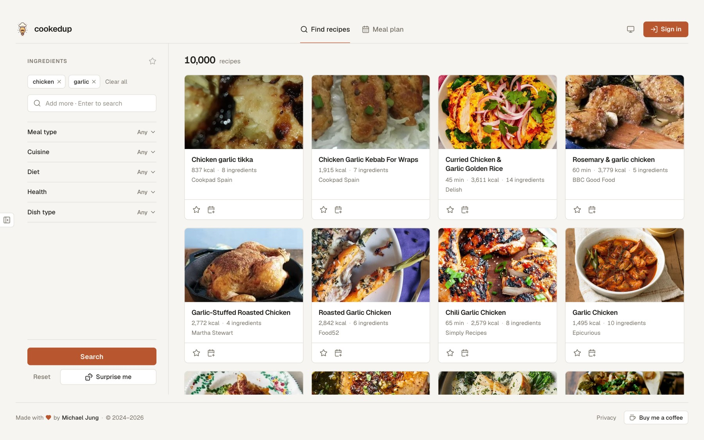
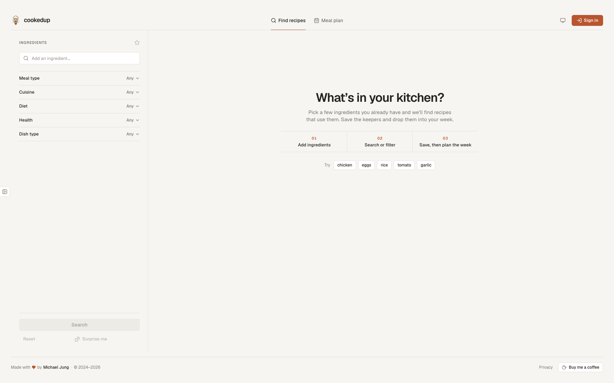
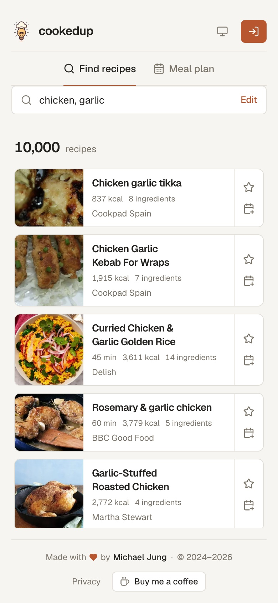
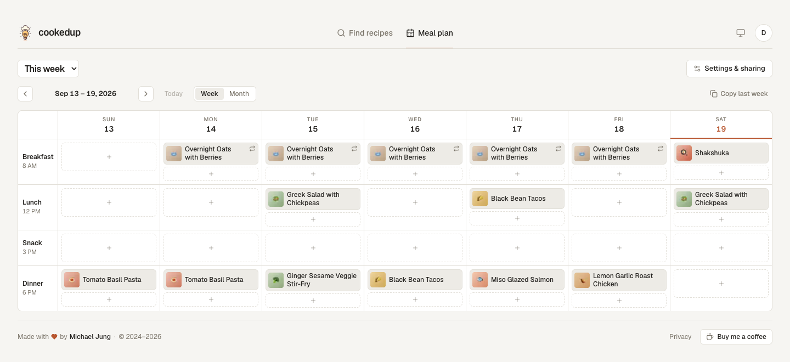
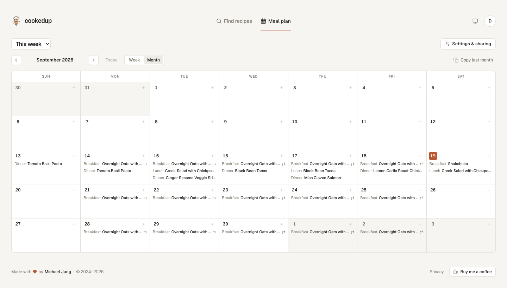
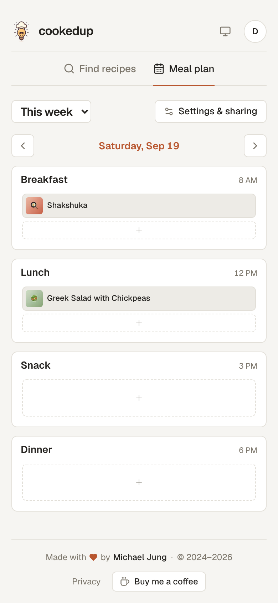

<div align="center" id="readme-header">


# cookedup

**Find recipes with what's already in your kitchen, then plan your week around them.**

[**Live site**](https://www.cookedup.app) &nbsp;•&nbsp; [GitHub](https://github.com/michaelhjung/cookedup)

[](https://www.typescriptlang.org/)
[](https://nextjs.org/)
[](https://tailwindcss.com/)
[](https://supabase.com/)
[](https://vercel.com/)

</div>

<picture>
  <source media="(prefers-color-scheme: dark)" srcset="./.github/readme/results-dark.jpg">
  
</picture>

## What it does

You tell it what's in the fridge; it tells you what to cook. No account needed to search.

- **Search by ingredient** — pick from a curated list or type your own, and get recipes that actually use them, with ingredient lists, calories and cook time on the card.
- **Or browse by filter** — cuisine, diet, health restrictions, meal and dish type, with infinite scroll and a "Surprise me" button that picks one for you.
- **Save the keepers** — starred recipes live in your library.
- **Plan the week** — drag saved recipes onto a calendar with fully customizable meal slots (rename, retime, add a second snack, drop breakfast).
- **Subscribe from any calendar app** — each plan exposes an ICS feed that Google Calendar, Apple Calendar or Outlook can follow.
- **Share it** — read-only share links for whoever eats with you, and editor invites for whoever cooks with you.
- **Sign in with Google or a magic link**, in light or dark mode, on desktop or phone.

<p align="center">
  <picture>
    <source media="(prefers-color-scheme: dark)" srcset="./.github/readme/empty-dark.png">
    
  </picture>
  &nbsp;
  <picture>
    <source media="(prefers-color-scheme: dark)" srcset="./.github/readme/phone-dark.jpg">
    
  </picture>
</p>

<picture>
  <source media="(prefers-color-scheme: dark)" srcset="./.github/readme/plan-week-dark.png">
  
</picture>

<p align="center">
  <picture>
    <source media="(prefers-color-scheme: dark)" srcset="./.github/readme/plan-month-dark.png">
    
  </picture>
  &nbsp;
  <picture>
    <source media="(prefers-color-scheme: dark)" srcset="./.github/readme/phone-plan-dark.png">
    
  </picture>
</p>

## How it's built

Next.js (App Router) on Vercel, Supabase for auth, Postgres and storage, the Edamam Recipe Search API for recipe data. Styling is Tailwind on top of a small set of design tokens (a two-step pastel palette, a three-value radius scale) so light and dark themes are a variable swap rather than parallel class lists.

A few of the decisions worth knowing about:

- **Recipe thumbnails are persisted on save.** Edamam serves images as pre-signed S3 URLs that expire, so a saved recipe's picture would break within days. Saving copies the image into a Supabase Storage bucket in a background `after()` task, so the star feels instant while the upload happens off the request.
- **Google sign-in uses a self-drawn button and the authorization-code flow.** Supabase's built-in OAuth redirect puts `<project>.supabase.co` on Google's consent screen, and Google's script-rendered button forces a white tile behind the logo in dark mode. Instead: Google Identity Services popup → one-time code → server-side exchange with the client secret → `signInWithIdToken`, all without leaving the page. Magic links go through a PKCE callback route.
- **Meal-plan drag and drop is hand-rolled on Pointer Events** — a 5px threshold for mouse, a 300ms long-press for touch so swipe-to-scroll keeps working, and a portaled ghost that follows the pointer.
- **The calendar feed is built by hand** (`src/lib/ics/`) — RFC 5545 line folding, escaping and floating (timezone-free) times, so a 6pm dinner is 6pm wherever the subscriber is. The event builder is a seam for pushing to Google Calendar directly later.
- **Meal slots are data, not an enum.** Each plan stores an ordered `[{ id, label, time }]` array, entries reference a slot id, and rows always render sorted by time — so a plan can have two snacks and no breakfast without a migration.
- **Filter-mode "load more" is a dedupe loop.** Edamam's random mode has no cursor, so scrolling redraws with the same filters and merges in whatever's new, backing off after a few draws yield nothing unseen.
- **A daily Vercel cron pings Supabase** so the free-tier project doesn't get paused for inactivity.

Pure logic (the ICS builder, date helpers, event assembly, the auth callback and Google code exchange) is unit-tested with Vitest; UI is verified in a real browser.

## Running it locally

You need Node 22.18+ (the seeder is TypeScript that Node runs directly),
Docker (OrbStack is fine), and the Supabase CLI, which comes in as a dev
dependency.

```bash
npm install
npm run db:start          # supabase start — first run pulls containers, be patient
cp .env.example .env.local
```

`npx supabase status` prints the API URL and the anon/service keys. Put them in
`.env.local`:

```
SUPABASE_URL=http://127.0.0.1:55321
SUPABASE_ANON_KEY=...
SUPABASE_SERVICE_ROLE_KEY=...
NEXT_PUBLIC_SUPABASE_URL=http://127.0.0.1:55321
NEXT_PUBLIC_SUPABASE_ANON_KEY=...
```

(The stack sits on ports 55321–55324 rather than the CLI's 54321 defaults so it
can run next to another project's.) Then:

```bash
npm run db:reset          # build the schema from migrations, then seed the demo account
npm run dev               # http://localhost:3001
```

| Variable                                               | Purpose                                                   |
| ------------------------------------------------------ | --------------------------------------------------------- |
| `EDAMAM_APP_ID`, `EDAMAM_API_KEY`                      | Edamam Recipe Search API v2 credentials                   |
| `SUPABASE_*`, `NEXT_PUBLIC_SUPABASE_*`                 | The local stack (above); production values live on Vercel |
| `ALLOW_TEST_LOGIN`                                     | Local only: the "Sign in as demo" button                  |
| `NEXT_PUBLIC_GOOGLE_CLIENT_ID`, `GOOGLE_CLIENT_SECRET` | Google sign-in (optional — the button hides without them) |
| `SUPABASE_DB_PASSWORD`                                 | Production only, read by `npm run db:push`                |
| `CRON_SECRET`                                          | Protects the keep-alive endpoint (optional locally)       |
| `NEXT_PUBLIC_UMAMI_ID`                                 | Umami analytics (optional)                                |

### Signing in

**Sign in as demo.** With `ALLOW_TEST_LOGIN=true` in `.env.local`, the sign-in
modal grows a **Sign in as demo** button that drops you into the seeded
account. The guard is server-side (`NODE_ENV` must not be production _and_ the
flag must be set), so on a production build neither the button nor the
`/api/test/login` route behind it exists.

**Magic link.** Type any address. Locally nothing leaves your machine: the mail
lands in **Mailpit at http://127.0.0.1:55324**, and the link in it signs you
in. If a link ever bounces you back signed out, the redirect isn't
allow-listed: `additional_redirect_urls` in `supabase/config.toml` has to cover
the app's `/auth/callback` on whatever port you're running.

**Google.** Works locally too once `NEXT_PUBLIC_GOOGLE_CLIENT_ID` and
`GOOGLE_CLIENT_SECRET` are in `.env.local` and `http://localhost:3001` is an
authorised JavaScript origin on the OAuth client. `npm run db:start` loads
`.env.local` before `supabase start`, which is how the client id reaches the
local auth server (`[auth.external.google]` in `config.toml`).

### The demo account

`npm run seed:demo` builds an account you can sign straight into, so testing a
change never starts with starring a page of recipes. `npm run db:reset` runs it
for you once the schema is rebuilt.

It creates `demo@cookedup.local` with eight recipes in the library (six
starred, two only ever planned), a plan for the current week with dinners most
nights and overnight oats repeating every weekday for four weeks, a second
"Meal prep" plan, and `friend@cookedup.local` joined as an editor through a
real invite — so sharing, the calendar feed, and the repeat-rule dialogs all
have something to act on. The password for both is `cookedup-demo`.

Recipes are written in Edamam's `Hit` shape (`scripts/demo-data.ts`) with
their images uploaded to the local `recipe-images` bucket, the same way a
starred search result is stored. The images are placeholders in
`supabase/seed/images/`; drop real photos in under the same names to make the
demo look the part. The script refuses to run against any host but localhost.

## Database

The schema lives in `supabase/migrations/` and nowhere else: `npm run db:reset`
rebuilds a local database from those files, and `npm run db:push` applies the
ones production hasn't seen (it reads `SUPABASE_DB_PASSWORD` from `.env.local`
and needs `npx supabase link` to have been run once). The files that were
already on production when the migrations were introduced are frozen; every
change since is a new dated file:

```bash
npx supabase migration new add_recipe_notes   # creates supabase/migrations/<timestamp>_add_recipe_notes.sql
npm run db:migrate                            # applies it locally (db:reset rebuilds from scratch instead)
npm run db:push                               # then to production
```

Or edit the schema in the local Studio (http://127.0.0.1:55323) and let
`npx supabase db diff -f add_recipe_notes` write the migration for you — read
it before pushing. A function whose signature changes is dropped by its old
signature and created again; `create or replace` would leave both.

Storage is set up by a migration too (the `recipe-images` bucket and its
policies), so a fresh database is ready for images without any dashboard
clicks.

```bash
npm run verify   # typecheck, lint, prettier, vitest
npm run build
```

---

<div align="center">

This project is **not open source**. The source code may not be copied, modified, or distributed without permission.

Copyright © 2024-2026 Michael Jung. All rights reserved.

</div>
